# Memora Scheduling Agent - System Architecture

## Overview
This document presents the comprehensive system architecture for Memora, an AI-powered local scheduling agent. The architecture follows a layered approach with clear separation of concerns across frontend, backend, database, and external service layers.

## System Architecture Diagram

```mermaid
flowchart TB
    %% User Layer
    subgraph USER ["👤 User Layer"]
        U1[User Browser]
        U2[Mobile Device]
    end

    %% Frontend Layer
    subgraph FRONTEND ["🌐 Frontend Layer (Next.js)"]
        direction TB
        subgraph PAGES ["Pages"]
            P1[Chat Page<br/>chat.js]
            P2[Calendar Page<br/>calendar.js]
            P3[Documents Page<br/>documents.js]
        end
        
        subgraph COMPONENTS ["React Components"]
            C1[ChatInterface<br/>Real-time messaging]
            C2[CalendarView<br/>FullCalendar integration]
            C3[DocumentUpload<br/>File handling]
            C4[DocumentSearch<br/>Search interface]
            C5[DocumentList<br/>Document management]
            C6[ChatSidebar<br/>Session management]
        end
        
        subgraph STYLES ["Styling & Assets"]
            S1[Tailwind CSS]
            S2[Global Styles]
        end
    end

    %% Backend Layer
    subgraph BACKEND ["⚙️ Backend Layer (FastAPI)"]
        direction TB
        subgraph API ["API Gateway"]
            A1[Main FastAPI App<br/>main.py]
            A2[CORS Middleware]
            A3[Document Routes<br/>document_routes.py]
        end
        
        subgraph AGENTS ["AI Agent System"]
            AG1[Scheduler Agent<br/>LangGraph State Machine]
            AG2[Document Enhancement<br/>RAG Processing]
            AG3[Agent State Manager<br/>Context & Flow Control]
        end
        
        subgraph DATA ["Data Layer"]
            D1[Task Manager<br/>database.py]
            D2[Document Processor<br/>Multi-format support]
            D3[Vector DB Manager<br/>vector_db.py]
            D4[Document Storage<br/>document_storage.py]
        end
        
        subgraph CONFIG ["Configuration"]
            CF1[Settings<br/>settings.py]
            CF2[Model Manager<br/>model_manager.py]
        end
    end

    %% Database Layer
    subgraph DATABASE ["🗄️ Database Layer"]
        direction TB
        subgraph STRUCTURED ["Structured Data"]
            DB1[(Tasks JSON<br/>tasks.json)]
            DB2[(Documents Metadata<br/>documents.json)]
        end
        
        subgraph VECTOR ["Vector Database"]
            DB3[(ChromaDB<br/>Vector Embeddings)]
            DB4[(SQLite Backend<br/>chroma.sqlite3)]
        end
        
        subgraph FILES ["File Storage"]
            DB5[Document Files<br/>storage/uploads/]
            DB6[Processed Content<br/>storage/processed/]
        end
    end

    %% External Services Layer
    subgraph EXTERNAL ["🔌 External Services (Local)"]
        direction TB
        EX1[Ollama Server<br/>LLM Inference Engine]
        EX2[Qwen 2.5 7B Model<br/>Natural Language Processing]
        EX3[Sentence Transformers<br/>Text Embeddings]
        EX4[Tesseract OCR<br/>Image Text Extraction]
        EX5[Poppler Utils<br/>PDF Processing]
    end

    %% Data Flow Connections
    
    %% User to Frontend
    U1 -.->|HTTP/WebSocket| FRONTEND
    U2 -.->|HTTP/WebSocket| FRONTEND
    
    %% Frontend Internal Connections
    P1 --> C1
    P1 --> C6
    P2 --> C2
    P3 --> C3
    P3 --> C4
    P3 --> C5
    
    %% Frontend to Backend API Calls
    C1 -->|POST /chat<br/>Natural Language Queries| A1
    C2 -->|GET /tasks<br/>GET /tasks/today<br/>GET /tasks/stats| A1
    C3 -->|POST /documents/upload<br/>File Upload| A3
    C4 -->|POST /documents/search<br/>GET /documents/search| A3
    C5 -->|GET /documents<br/>DELETE /documents/{id}| A3
    
    %% Backend Internal Flow
    A1 --> AG1
    A3 --> AG2
    AG1 --> AG3
    AG1 --> D1
    AG2 --> D2
    AG2 --> D3
    A3 --> D4
    
    %% Configuration Flow
    CF1 --> CF2
    CF2 --> AG1
    CF1 --> A1
    
    %% Backend to Database
    D1 -->|Read/Write Tasks| DB1
    D4 -->|Store Metadata| DB2
    D3 -->|Vector Operations| DB3
    DB3 --> DB4
    D2 -->|Store Files| DB5
    D2 -->|Store Processed Content| DB6
    
    %% Backend to External Services
    AG1 -->|LLM Requests| EX1
    AG2 -->|LLM Requests| EX1
    EX1 --> EX2
    D3 -->|Generate Embeddings| EX3
    D2 -->|OCR Processing| EX4
    D2 -->|PDF Conversion| EX5
    
    %% Styling
    classDef userClass fill:#e1f5fe,stroke:#0277bd,stroke-width:2px
    classDef frontendClass fill:#f3e5f5,stroke:#7b1fa2,stroke-width:2px
    classDef backendClass fill:#e8f5e8,stroke:#2e7d32,stroke-width:2px
    classDef databaseClass fill:#fff3e0,stroke:#ef6c00,stroke-width:2px
    classDef externalClass fill:#fce4ec,stroke:#c2185b,stroke-width:2px
    
    class USER userClass
    class FRONTEND frontendClass
    class BACKEND backendClass
    class DATABASE databaseClass
    class EXTERNAL externalClass
```

## Architecture Components

### 👤 User Layer
- **User Browser**: Primary web interface for desktop users
- **Mobile Device**: Mobile-responsive interface access

### 🌐 Frontend Layer (Next.js)
- **Pages**: Main application routes (Chat, Calendar, Documents)
- **React Components**: Reusable UI components for different functionalities
- **Styling**: Tailwind CSS for responsive design

### ⚙️ Backend Layer (FastAPI)
- **API Gateway**: Main FastAPI application with CORS middleware
- **AI Agent System**: LangGraph-based intelligent agents for NLP and document processing
- **Data Layer**: Managers for tasks, documents, and vector operations
- **Configuration**: Settings and model management

### 🗄️ Database Layer
- **Structured Data**: JSON-based storage for tasks and document metadata
- **Vector Database**: ChromaDB for semantic search and embeddings
- **File Storage**: Physical storage for uploaded and processed documents

### 🔌 External Services (Local)
- **Ollama Server**: Local LLM inference engine
- **AI Models**: Qwen 2.5 7B for natural language processing
- **Processing Tools**: OCR, PDF processing, and text embeddings

## Data Flow
1. **User Interaction**: Browser/mobile → Frontend components
2. **API Communication**: Frontend → Backend via REST endpoints
3. **AI Processing**: Backend agents → Local AI services
4. **Data Persistence**: Backend → Database layer
5. **Real-time Updates**: WebSocket connections for live synchronization

## Key Features
- **Local-First Architecture**: Complete privacy with no external API dependencies
- **Microservices Design**: Clear separation of concerns for maintainability
- **RAG Implementation**: Document awareness through vector embeddings
- **State Management**: LangGraph for complex conversational flows
- **Multi-Format Support**: Comprehensive document processing capabilities

---

## Use Case Diagram

```mermaid
%%{init: {'theme': 'default'}}%%
flowchart LR
    %% Actors
    subgraph ACTORS [" "]
        U1["👤<br/>End User<br/>(Primary)"]
        U2["👨‍💼<br/>System Admin<br/>(Secondary)"]
        U3["🤖<br/>AI System<br/>(External)"]
        U4["📁<br/>File System<br/>(External)"]
    end

    %% System Boundary
    subgraph SYSTEM ["🎯 Memora Scheduling Agent System"]
        direction TB
        
        %% Core Scheduling Use Cases
        subgraph SCHEDULING ["📅 Scheduling Management"]
            UC1((Create Task))
            UC2((Update Task))
            UC3((Delete Task))
            UC4((View Schedule))
            UC5((Search Tasks))
            UC6((Bulk Operations))
        end
        
        %% Chat & Interaction Use Cases
        subgraph INTERACTION ["💬 User Interaction"]
            UC7((Chat with Agent))
            UC8((Manage Sessions))
            UC9((View Chat History))
            UC10((Natural Language<br/>Processing))
        end
        
        %% Document Management Use Cases
        subgraph DOCUMENTS ["📚 Document Management"]
            UC11((Upload Document))
            UC12((Search Documents))
            UC13((View Documents))
            UC14((Delete Document))
            UC15((Process Document<br/>Content))
        end
        
        %% AI & Intelligence Use Cases
        subgraph AI ["🧠 AI Services"]
            UC16((Generate Response))
            UC17((Extract Information))
            UC18((Understand Intent))
            UC19((Semantic Search))
            UC20((Document Analysis))
        end
        
        %% System Management Use Cases
        subgraph MANAGEMENT ["⚙️ System Management"]
            UC21((Configure System))
            UC22((Monitor Health))
            UC23((Manage Models))
            UC24((View Logs))
            UC25((Backup Data))
        end
    end

    %% Primary User Interactions
    U1 ---|"initiates"| UC1
    U1 ---|"performs"| UC2
    U1 ---|"executes"| UC3
    U1 ---|"accesses"| UC4
    U1 ---|"queries"| UC5
    U1 ---|"requests"| UC6
    U1 ---|"converses"| UC7
    U1 ---|"controls"| UC8
    U1 ---|"reviews"| UC9
    U1 ---|"uploads"| UC11
    U1 ---|"searches"| UC12
    U1 ---|"browses"| UC13
    U1 ---|"removes"| UC14

    %% System Admin Interactions
    U2 ---|"manages"| UC21
    U2 ---|"monitors"| UC22
    U2 ---|"configures"| UC23
    U2 ---|"analyzes"| UC24
    U2 ---|"performs"| UC25

    %% AI System Interactions
    U3 ---|"processes"| UC10
    U3 ---|"creates"| UC16
    U3 ---|"analyzes"| UC17
    U3 ---|"interprets"| UC18
    U3 ---|"executes"| UC19
    U3 ---|"performs"| UC20

    %% File System Interactions
    U4 ---|"stores"| UC15
    U4 ---|"provides"| UC25

    %% Use Case Dependencies (extends/includes)
    UC7 -.->|"includes"| UC10
    UC7 -.->|"includes"| UC16
    UC1 -.->|"includes"| UC18
    UC5 -.->|"includes"| UC19
    UC11 -.->|"includes"| UC15
    UC12 -.->|"includes"| UC19
    UC12 -.->|"includes"| UC20
    UC6 -.->|"extends"| UC1
    UC13 -.->|"extends"| UC12

    %% Styling
    classDef actorClass fill:#e3f2fd,stroke:#1976d2,stroke-width:3px,color:#000
    classDef useCaseClass fill:#fff,stroke:#666,stroke-width:2px,color:#000
    classDef systemClass fill:#f8f9fa,stroke:#333,stroke-width:2px
    classDef groupClass fill:#f5f5f5,stroke:#999,stroke-width:1px
    
    class U1,U2,U3,U4 actorClass
    class UC1,UC2,UC3,UC4,UC5,UC6,UC7,UC8,UC9,UC10,UC11,UC12,UC13,UC14,UC15,UC16,UC17,UC18,UC19,UC20,UC21,UC22,UC23,UC24,UC25 useCaseClass
    class SYSTEM systemClass
    class SCHEDULING,INTERACTION,DOCUMENTS,AI,MANAGEMENT groupClass
```



## Use Case Descriptions

### 👤 Primary Actor: End User
The main user of the system who interacts with the scheduling agent for personal productivity.

**Core Use Cases:**
- **Create Task**: Add new tasks through natural language or structured input
- **Update Task**: Modify existing task details, dates, and priorities
- **Delete Task**: Remove tasks individually or in bulk
- **View Schedule**: Access calendar and task views with various time ranges
- **Search Tasks**: Find specific tasks using keywords or filters
- **Bulk Operations**: Perform multiple task operations simultaneously

**Interaction Use Cases:**
- **Chat with Agent**: Engage in natural language conversations
- **Manage Sessions**: Control multiple chat sessions
- **View Chat History**: Access previous conversations and context

**Document Use Cases:**
- **Upload Document**: Add personal documents for context awareness
- **Search Documents**: Find relevant documents using semantic search
- **View Documents**: Browse uploaded documents and metadata
- **Delete Document**: Remove documents from the system

### 👨‍💼 Secondary Actor: System Administrator
Technical user responsible for system configuration and maintenance.

**Management Use Cases:**
- **Configure System**: Adjust system settings and parameters
- **Monitor Health**: Check system status and performance
- **Manage Models**: Control AI model selection and updates
- **View Logs**: Access system logs for troubleshooting
- **Backup Data**: Perform data backup and recovery operations

### 🤖 External Actor: AI System
Represents the local AI services (Ollama, models) that process requests.

**AI Processing Use Cases:**
- **Natural Language Processing**: Parse and understand user input
- **Generate Response**: Create contextual responses to user queries
- **Extract Information**: Pull relevant data from documents and context
- **Understand Intent**: Determine user intentions from natural language
- **Semantic Search**: Perform intelligent document and task searching
- **Document Analysis**: Process and analyze uploaded documents

### 📁 External Actor: File System
Represents the local storage system for persistence.

**Storage Use Cases:**
- **Process Document Content**: Handle file storage and retrieval
- **Backup Data**: Provide persistent storage for system data

## Use Case Relationships

### Include Relationships
- **Chat with Agent** includes **Natural Language Processing** and **Generate Response**
- **Create Task** includes **Understand Intent**
- **Search Tasks** includes **Semantic Search**
- **Upload Document** includes **Process Document Content**
- **Search Documents** includes **Semantic Search** and **Document Analysis**

### Extend Relationships
- **Bulk Operations** extends **Create Task** (for multiple task creation)
- **View Documents** extends **Search Documents** (enhanced viewing capabilities)

## System Boundaries
The system is clearly bounded by the Memora Scheduling Agent, with external actors (AI System, File System) providing services while remaining outside the core system boundary.